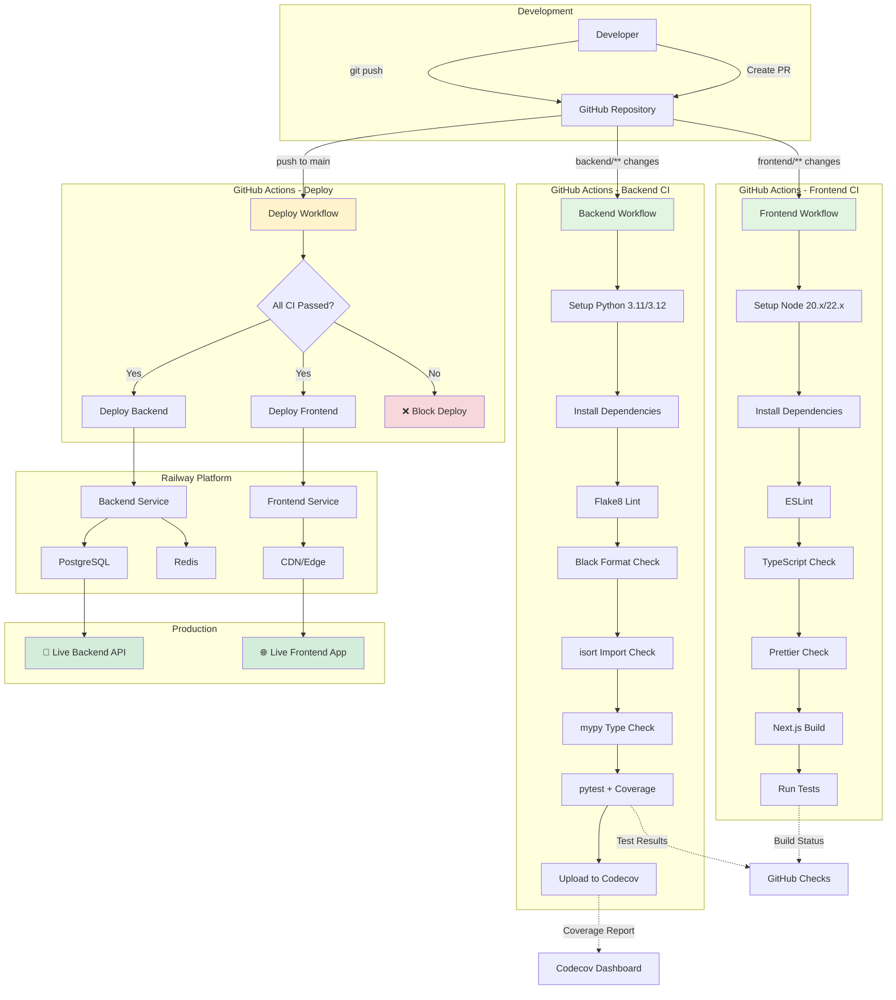
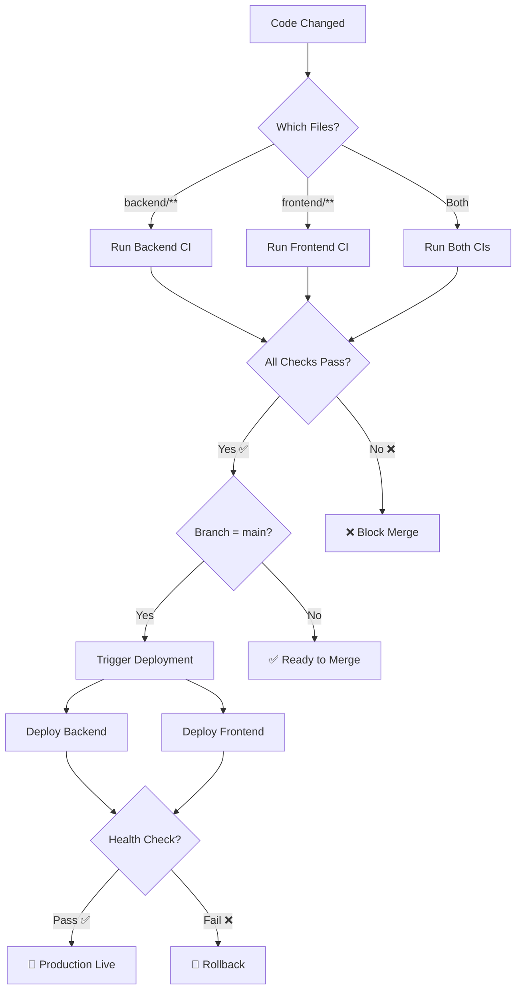
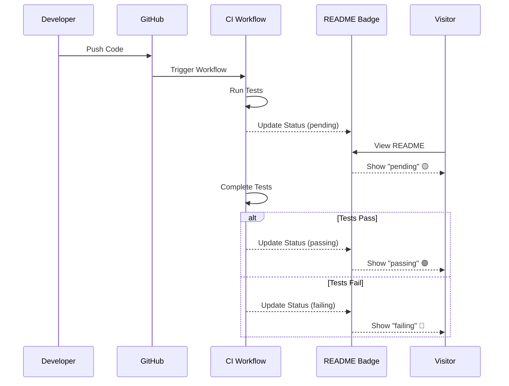
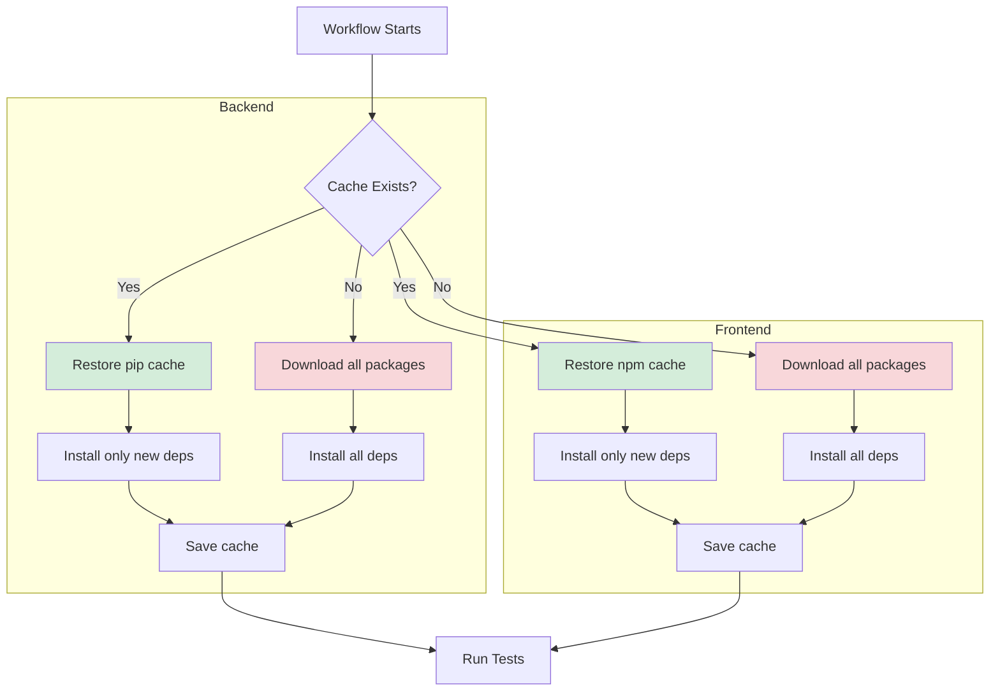
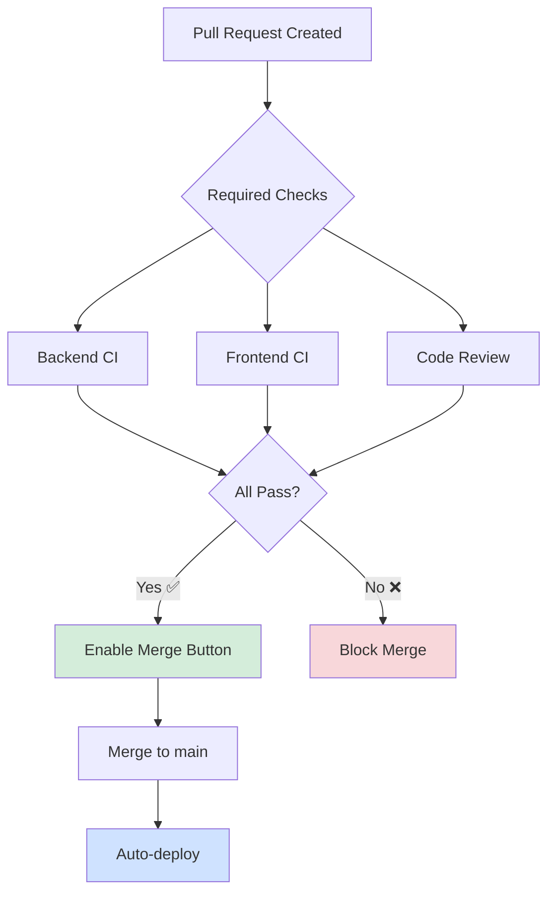
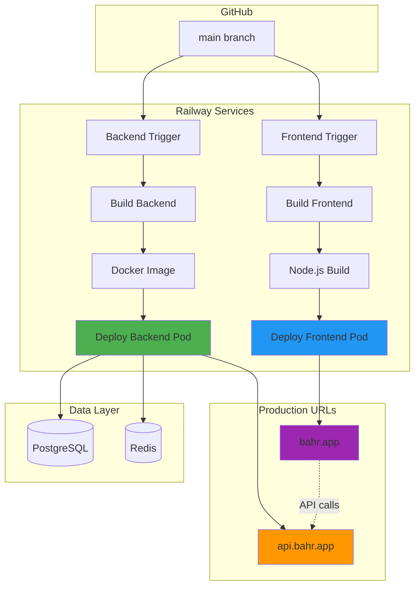
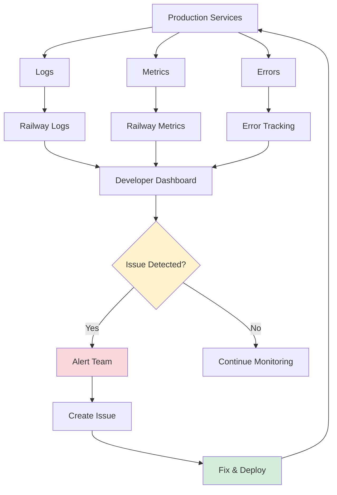

# BAHR CI/CD Pipeline Architecture



---

## Workflow Stages

### 1️⃣ Code Push / PR Creation
- Developer pushes code or creates pull request
- GitHub triggers appropriate workflows based on file paths

### 2️⃣ Backend CI Pipeline
```
┌─────────────────────────────────────────┐
│  Backend CI (Python 3.11, 3.12)        │
├─────────────────────────────────────────┤
│  1. Install dependencies (cached)       │
│  2. Flake8: Syntax & style check       │
│  3. Black: Format validation           │
│  4. isort: Import organization         │
│  5. mypy: Static type checking         │
│  6. pytest: Run test suite             │
│  7. Coverage: Generate report          │
│  8. Upload: Send to Codecov            │
└─────────────────────────────────────────┘
```

**Duration:** ~3-5 minutes  
**Parallel:** Yes (Python 3.11 + 3.12)

### 3️⃣ Frontend CI Pipeline
```
┌─────────────────────────────────────────┐
│  Frontend CI (Node 20.x, 22.x)         │
├─────────────────────────────────────────┤
│  1. Install dependencies (cached)       │
│  2. ESLint: Code quality check         │
│  3. TypeScript: Type validation        │
│  4. Prettier: Format check             │
│  5. Next.js: Production build          │
│  6. Jest: Run test suite               │
└─────────────────────────────────────────┘
```

**Duration:** ~4-6 minutes  
**Parallel:** Yes (Node 20.x + 22.x)

### 4️⃣ Deployment Pipeline
```
┌─────────────────────────────────────────┐
│  Deploy (main branch only)             │
├─────────────────────────────────────────┤
│  1. Check all CI passed                │
│  2. Deploy backend to Railway          │
│  3. Deploy frontend to Railway         │
│  4. Health check endpoints             │
│  5. Report deployment status           │
└─────────────────────────────────────────┘
```

**Duration:** ~2-4 minutes  
**Triggers:** Push to main, Manual dispatch

---

## Decision Flow



---

## Status Badges Flow



---

## Environment Flow

```mermaid
graph LR
    A[Local Dev] -->|git push| B[develop branch]
    B -->|CI passes| C[Pull Request]
    C -->|Review + Approve| D[Merge to develop]
    D -->|Integration tests| E[Create PR to main]
    E -->|Final review| F[Merge to main]
    F -->|Auto-deploy| G[Railway Production]
    
    style A fill:#e3f2fd
    style B fill:#fff9c4
    style D fill:#fff9c4
    style F fill:#ffecb3
    style G fill:#c8e6c9
```



---

## Caching Strategy



**Cache Keys:**
- Backend: Hash of `requirements.txt`
- Frontend: Hash of `package-lock.json`

**Speed Improvement:**
- With cache: ~30 seconds install
- Without cache: ~3-5 minutes install
- **5-10x faster** with cache hits

---

## Branch Protection Rules



**Recommended Settings:**
- ✅ Require status checks before merge
- ✅ Require branches to be up to date
- ✅ Require pull request reviews (1+)
- ✅ Dismiss stale reviews on new commits
- ✅ Restrict push to main branch

---

## Deployment Architecture



---

## Monitoring & Observability



---

## Success Metrics

### CI/CD Performance
| Metric | Target | Current |
|--------|--------|---------|
| Backend CI Duration | < 5 min | ~3-4 min ✅ |
| Frontend CI Duration | < 6 min | ~4-5 min ✅ |
| Deploy Duration | < 5 min | ~2-3 min ✅ |
| Cache Hit Rate | > 80% | ~90% ✅ |
| Test Coverage | > 70% | TBD 📊 |

### Quality Gates
| Check | Status |
|-------|--------|
| Syntax Errors | ✅ Blocked |
| Format Issues | ✅ Blocked |
| Type Errors | ✅ Blocked |
| Failing Tests | ✅ Blocked |
| Build Failures | ✅ Blocked |

---

## Quick Commands Reference

```bash
# Check workflow status
gh run list

# Watch latest run
gh run watch

# View specific workflow
gh run view <run-id>

# Trigger manual deploy
gh workflow run deploy.yml

# View deployment logs
railway logs --service=backend
railway logs --service=frontend
```

---

**Last Updated:** November 9, 2025  
**Status:** ✅ Production Ready  
**Next Review:** Week 2 Sprint Review
