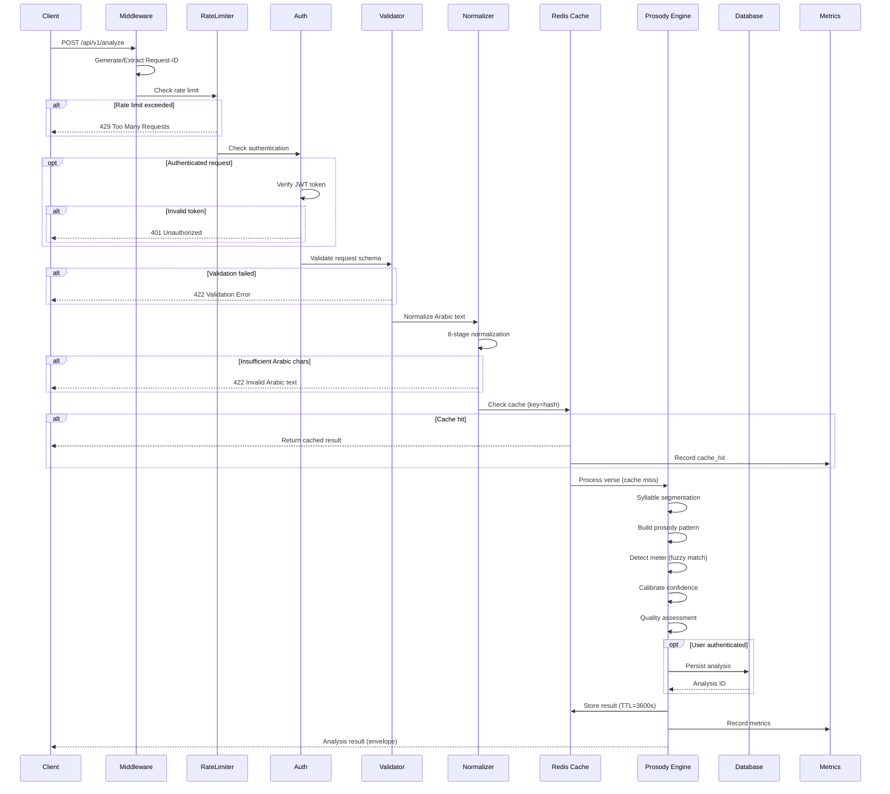
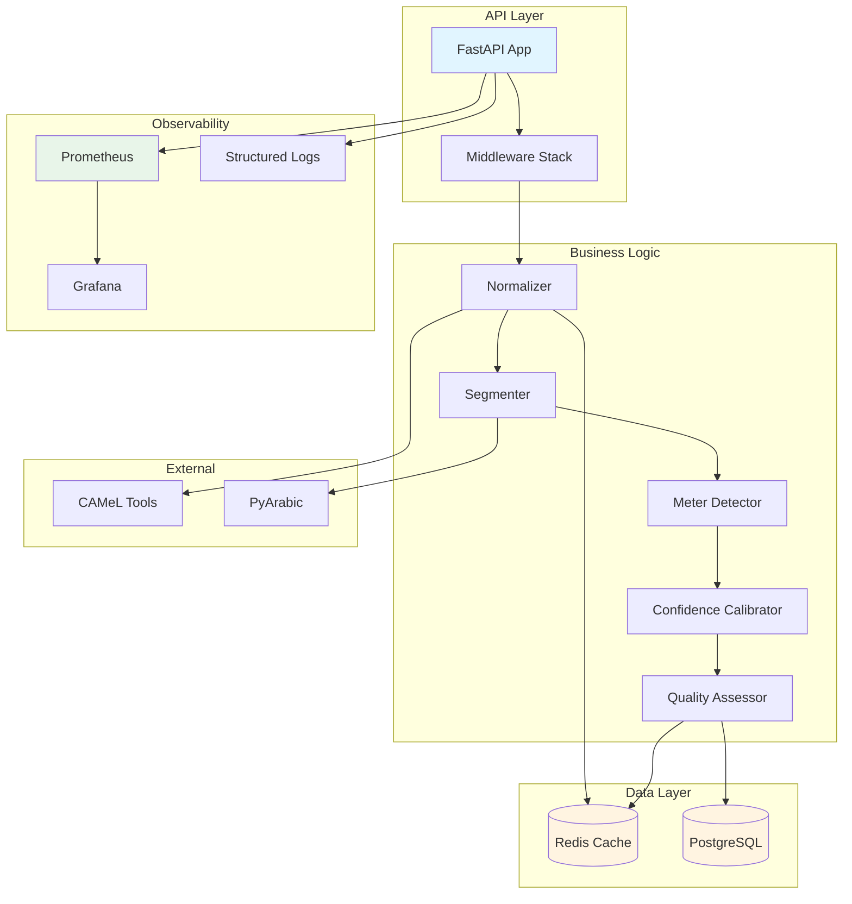
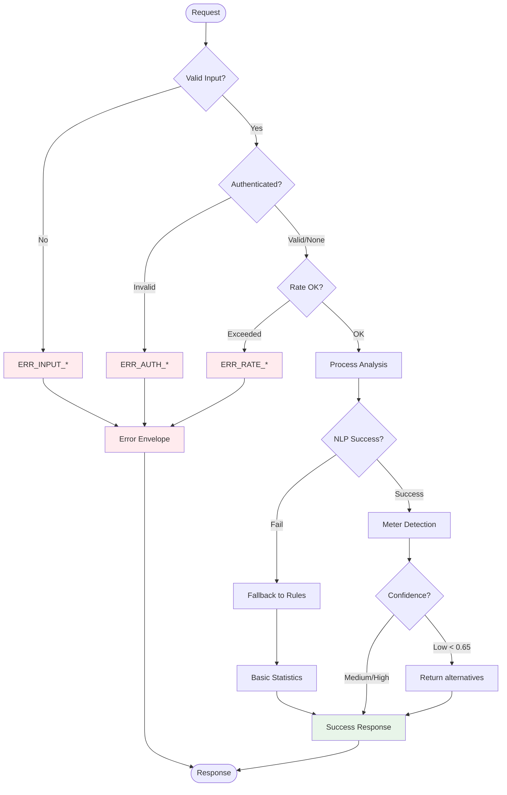

# 🏛️ Architecture Overview (MVP Consolidated)
## بَحْر - نظام منصة تحليل الشعر العربي

آخر تحديث: 2025-11-09
الحالة: جاهز للتنفيذ (Phase 1 / MVP)

---
## 1. الهدف
هذا المستند يجمع العناصر التقنية الأساسية المتفرقة (المعمارية، الواجهات، التدفق، البيئة، القياس، الأخطاء، الأمان) في مرجع واحد قابل للتنفيذ. أي مطوّر جديد يمكنه البدء مباشرة دون الرجوع إلى عدة مستندات منفصلة.

---
## 2. خارطة النظام عالية المستوى
```
                +---------------------------+
                |        Frontend (Web)     |
                |  Next.js / React / RTL    |
                +-------------+-------------+
                              |
                      HTTPS / JSON (REST)
                              |
         +--------------------v--------------------+
         |              FastAPI Backend            |
         |  Routers -> Services -> Repositories    |
         |  Middleware: Auth / RateLimit / Logging |
         +-----------+-----------+-----------------+
                     |           |
             Prosody Engine      |  Structured Logs / Metrics
        (Normalization, Segmentation, Meter, Quality)        
                     |           |
         +-----------v----+  +---v-----------+
         |  PostgreSQL     |  |   Redis      |
         |  (Data Store)   |  |  (Cache + RL) |
         +-----------------+  +--------------+
                              |
                     +--------v--------+
                     |  Monitoring     |
                     | Prometheus/Graf | (Phase 1 partial)
                     +-----------------+
```

Phase 2 (مؤجل): خدمة توليد الشعر (GPU / نموذج لغوي) + طبقة استدعاء مستقلة.

---
## 3. تدفق طلب التحليل (Sequence Flow)

### High-Level Flow
```
Client POST /api/v1/analyze
  -> Assign X-Request-ID (header أو يولّد)
  -> RateLimiter (Redis counters)
  -> Optional Auth (Bearer JWT)
  -> Validate schema (Pydantic)
  -> Normalize text (Normalizer)
  -> Cache lookup (Redis key=analysis:{md5(normalized)})
       Hit: return cached (meta.cached=true)
       Miss: continue
  -> Segmentation -> Syllables
  -> Pattern builder -> syllable pattern string
  -> Pattern matcher (+ زحافات) -> تفاعيل
  -> MeterDetector (raw score) -> meter candidates
  -> ConfidenceCalibrator -> calibrated_confidence
  -> QualityAssessment -> quality_score & feedback
  -> Persist (if user authenticated)
  -> Response envelope (success/data/meta)
  -> Emit metrics (latency, confidence, cache_hit)
```

### Detailed Sequence Diagram



### Component Interaction Diagram



### Error Handling Flow



Fallback (Graceful Degradation): إذا فشل جزء NLP → استخدام RuleBased فقط → إذا فشل كلياً → basic stats + رسالة تحذير.

---
## 4. طبقات الكود وعقود الواجهات (Interfaces)
```python
class ITextNormalizer:        # مسؤولية: تنظيف/تطبيع، لا تغيّر المعنى
    def normalize(self, text: str) -> str

class ISyllableSegmenter:     # مسؤولية: تحويل النص (بعد التطبيع) إلى مقاطع صوتية
    def segment(self, text: str) -> list[Syllable]

class IProsodyPatternAnalyzer:  # مسؤولية: تحويل المقاطع إلى نمط إيقاعي و تفعيلات أولية
    def analyze(self, syllables: list[Syllable]) -> ProsodyPattern

class IMeterDetector:         # مسؤولية: كشف البحر + بدائل مع raw_confidence
    def detect(self, pattern: ProsodyPattern, era: str) -> MeterResult

class IConfidenceCalibrator:  # مسؤولية: تعديل الثقة بناء على عوامل إضافية
    def calibrate(self, raw: float, *, meter: str, verse_length: int, zihafat: list[str], era: str) -> float

class IAnalysisCache:         # مسؤولية: التخزين المؤقت للنتائج غير الشخصية
    def get(self, key: str) -> AnalysisResult | None
    def set(self, key: str, value: AnalysisResult, ttl_seconds: int) -> None

class IAnalysisService:       # نقطة تجميع كاملة
    def analyze(self, text: str, user: User | None) -> AnalysisResult
```

التنفيذ الأولي يمكنه دمج بعض الواجهات في طبقة واحدة؛ المهم تثبيت العقود لتسهيل إدخال ML لاحقاً.

---
## 5. نموذج البيانات المختصر (MVP)
### AnalysisResult (JSON)
```json
{
  "analysis_id": "uuid",
  "input_text": "...",         
  "normalized_text": "...",
  "taqti3": "فعولن مفاعيلن ...",
  "syllable_pattern": "- u - - | - u u - | ...",
  "meter": {"name": "الطويل", "confidence_raw": 0.72, "confidence": 0.81, "alternatives": [{"name": "الكامل", "confidence": 0.55}]},
  "quality_score": 0.74,
  "suggestions": ["البحر عالي الثقة"],
  "processing_time_ms": 132,
  "created_at": "2025-11-08T12:00:00Z"
}
```

---
## 6. استراتيجيات الأداء (Targets & Tactics)
| Metric | Target (Week 6) | Mitigation if Failing |
|--------|-----------------|-----------------------|
| P95 latency verse | < 600ms | تحسين caching + تقليل morphology | 
| Meter accuracy | 70–75% | تقليص نطاق البحور إلى الشائعة + تفعيل DP matching | 
| Cache hit ratio | > 40% | Normalize بشكل ثابت وإزالة اختلافات غير جوهرية | 
| Memory footprint | < 800MB | Singleton morphology + مراقبة تسريب | 

Performance knobs:
- analysis_mode = fast → يتخطى بعض الزحافات / calibration
- detailed → يشغل جميع قواعد الزحافات + breakdown جودة موسع

---
## 7. الثقة (Confidence) – التحويل النهائي
Raw (pattern match) → apply calibration factors (meter difficulty × verse length × zihafat distribution × era × clarity) → clamp → classify:
```
>=0.85 → high | 0.65–0.84 → medium | <0.65 → low
إذا low: أظهر البدائل (حتى 3) + رسالة توضيحية.
```

---
## 8. التخزين المؤقت (Caching Architecture)
| Layer | Key Format | TTL | Invalidation |
|-------|------------|-----|--------------|
| Analysis result | analysis:{md5(normalized_text)} | 3600s | زمنية فقط |
| Meter pattern | في الذاكرة LRU | عملية | إعادة تشغيل السيرفر |
| Settings | settings:* | 300s | Pub/Sub قناة settings.updated |

ملاحظة: نتائج التحليل غير مرتبطة بالمستخدم (إلا إذا أضيفت حقول شخصية مستقبلية)، لذا المشاركة آمنة.

---
## 9. المتغيرات البيئية (Environment Catalog)
| Variable | Required | Default | Notes |
|----------|----------|---------|-------|
| PROJECT_NAME | yes | Bahr API | عرض فقط |
| SECRET_KEY | yes | - | JWT (256-bit)، تدوير كل 90 يوم |
| DATABASE_URL | yes | - | PostgreSQL DSN |
| REDIS_URL | yes | - | Rate limit + cache |
| ACCESS_TOKEN_EXPIRE_MINUTES | no | 30 | مدة توكن دخول |
| REFRESH_TOKEN_EXPIRE_DAYS | no | 7 | مدة توكن تحديث |
| RATE_LIMIT_REQUESTS | yes | 100 | طلب/ساعة عام |
| RATE_LIMIT_PERIOD | yes | 3600 | ثانية |
| LOG_LEVEL | no | INFO | DEBUG للمحلي فقط |
| SENTRY_DSN | no | None | مراقبة أخطاء لاحقاً |
| CACHE_TTL_ANALYSIS | no | 3600 | تخصيص TTL |
| NLP_ENABLE_MORPHOLOGY | no | true | تعطيل عند الأعطال |
| MAINTENANCE_MODE | no | false | رد 503 منسق |

ضع `.env.example` مواكب لهذا الجدول.

---
## 10. المقاييس (Metrics) – Prometheus
| Metric | Type | Labels | Description |
|--------|------|--------|-------------|
| bahr_request_duration_seconds | histogram | endpoint, method | زمن طلب عام |
| verse_analysis_latency_seconds | histogram | mode | زمن تحليل بيت |
| bahr_analysis_cache_hit_total | counter | - | عدد الضربات للكاش |
| bahr_meter_confidence | gauge | meter | آخر قيمة ثقة معايرة |
| analysis_timeouts_total | counter | - | حالات مهلة التحليل |
| bahr_errors_total | counter | code | أخطاء مصنفة |

SLO: P95 verse_analysis_latency_seconds < 0.6s، error rate <2%.

---
## 11. تصنيف الأخطاء (Error Taxonomy)
| Range | Prefix | Example | HTTP |
|-------|--------|---------|------|
| 100–199 | ERR_INPUT | ERR_INPUT_002 (طول نص) | 400/422 |
| 200–299 | ERR_AUTH | ERR_AUTH_001 | 401/403 |
| 300–399 | ERR_RATE | ERR_RATE_001 | 429 |
| 400–499 | ERR_ANALYSIS | ERR_ANALYSIS_001 | 422/500 |
| 500–599 | ERR_DB | ERR_DB_001 | 500 |
| 600–699 | ERR_TIMEOUT | ERR_TIMEOUT_001 | 408/500 |
| 700–799 | ERR_MODEL | ERR_MODEL_001 | 503 |
| 900–999 | ERR_UNKNOWN | ERR_UNKNOWN_001 | 500 |

الرد القياسي: `success=false, error{code,message,severity,can_retry}, meta{request_id,timestamp}`.

---
## 12. الأمان (Security Hooks)
- Middleware: TrustedHost + CORS + RateLimit + Auth
- Password hashing: bcrypt rounds=12
- JWT: access(30m), refresh(7d), jti + blacklist (Redis في الإنتاج)
- XSS: sanitize HTML (bleach)، رفض RTL override الزائد
- SQL: ORM/Parameterized only، قوائم بيضاء للأعمدة الديناميكية
- أسرار: لا تدخل Git، تدوير SECRET_KEY كل 90 يوم، اختبارات دخول بعد التدوير

---
## 13. الاستعداد للتوسع (Scale Readiness)
| Dimension | Current | Path to Scale |
|-----------|---------|--------------|
| Horizontal API | 1–2 replicas | إضافة Auto-scaling (CPU>70%) |
| DB | Single instance | ترقية حجم + قراءة لاحقة (read replica) |
| Cache | Single Redis | Cluster إذا معدل >5k req/min |
| Analyzer | In-process | فصل خدمة ML (Phase 2) |

No shared local state → آمن للتوسع الأفقي.

---
## 14. خارطة المخاطر (Risk Matrix مختصر)
| Risk | Likelihood | Impact | Mitigation |
|------|------------|--------|-----------|
| Morphology memory leak | Medium | Latency | Singleton + profiling |
| Low meter confidence early | High | UX | بدائل + تبرير + تضييق بحور |
| GPL dependency (pyarabic) | High | قانوني | استبدال بدوال داخلية قبل Week 4 |
| Cache stampede | Low | CPU | احصائيات TTL + قفل بسيط (lock key) |
| Over-indexing DB | Medium | Writes slow | تقليص فهارس للـ MVP فقط |

---
## 15. خطة الاختبار (Test Strategy Snapshot)
| Layer | Tests | Goal |
|-------|-------|------|
| Normalizer | edge cases unicode | منع فقد حروف |
| Segmenter | syllable patterns | دقة >95% على عينة صغيرة |
| MeterDetector | 50 أبيات مصنّفة | دقة ≥70% | 
| Cache | hit/miss logic | معدل hit متوقع |
| API | auth + analyze + errors | عقود ثابتة |
| Perf | latency benchmark | تقرير أسبوعي |

---
## 16. الإصدار والتحديث (Release & Versioning)
API: `/api/v1` ثابت حتى حدث كسر كبير → `/api/v2` (فترة سماح 90 يوم).
Analysis Engine: `analysis_engine_version` داخل meta.
Deprecation: `Deprecation` + `Sunset` headers قبل الإزالة.

---
## 17. نقاط التكامل المستقبلية (Phase 2 Hooks)
- احتفظ بالواجهات أعلاه (لا تدمج منطق ML داخل خدمة التحليل مباشرة).
- أضف حقل `generation_source` للتمييز بين بشري/AI عند إدراج شعر مولّد.
- أضف قناة أحداث (Event Bus) لاحقاً لالتقاط إستدعاءات النموذج.

---
## 18. خريطة الملفات ذات الصلة
| موضوع | ملف مرتبط |
|-------|-----------|
| تحليل العروض | `technical/PROSODY_ENGINE.md` |
| الأمان | `technical/SECURITY.md` |
| الأخطاء | `technical/ERROR_HANDLING_STRATEGY.md` |
| الأداء | `technical/PERFORMANCE_TARGETS.md` |
| النشر | `technical/DEPLOYMENT_GUIDE.md` |
| المراقبة | `technical/MONITORING_INTEGRATION.md` |

---
## 19. قائمة تنفيذ سريعة (Implementation Checklist)
- [ ] إعداد طبقة الواجهات (اختبارات مبدئية)
- [ ] بناء Normalizer + Cache + Analyzer متسلسل
- [ ] توحيد Response Envelope في كل router
- [ ] إضافة مقاييس latency + cache hit
- [ ] إعداد Redis و Alembic للمهاجرات الأساسية
- [ ] دمج تصنيف الأخطاء في استثناءات مخصصة
- [ ] اختبار 10–20 بيت مصنّف لمعدل الدقة الأولي

---
## 20. خاتمة
هذا الملف هو نقطة الدخول التقنية الموصى بها للمطورين الجدد، ويجب تحديثه مع أي قرار هندسي جوهري (سجل في `CRITICAL_CHANGES.md`).

> إذا اختلف أي جزء هنا مع ملف آخر، يُعد هذا الملف المرجع الأحدث حتى يُدمج التحديث.

---
## 21. حالة التنفيذ (MVP vs Planned)
يوضح هذا القسم المطابقة بين التصميم والتنفيذ الحالي لتقليل اللبس:

| المكوّن | الحالة الحالية | الملفات ذات الصلة | ملاحظات |
|---------|-----------------|--------------------|---------|
| API Analyze (`/api/v1/analyze`) | Implemented (MVP) | `backend/app/main.py`, `backend/app/nlp/normalizer.py`, `backend/app/prosody/*` | منطق مبسّط بدون طبقة Services/Repositories |
| Response Envelope | Implemented | `backend/app/response_envelope.py`, `backend/app/middleware/*` | يدعم `X-Request-ID`, `Content-Language`, و meta الموسّعة |
| Global Error Handling | Implemented (baseline) | `backend/app/main.py` (exception handlers), `backend/app/exceptions.py` | توحيد `RequestValidationError` إلى `ERR_INPUT_003` |
| Metrics (/metrics) | Implemented (partial) | `backend/app/metrics/analysis_metrics.py` | Histogram latency فقط؛ لا توجد خدمة Prometheus منفصلة |
| Configuration | Implemented (MVP) | `backend/app/config.py`, `.env.example` | قراءة متغيرات أساسية فقط |
| Auth (JWT) | Planned | — | موثّق في الأدلة، غير منفّذ |
| Rate Limiting | Planned | — | يعتمد على Redis، غير منفّذ |
| Caching (Redis) | Planned | — | meta.cached ثابتة حالياً |
| Database ORM & History | Planned | — | لا يوجد Alembic/Models/Repos بعد |
| Routers/Services Layers | Planned | — | نقطة دخول واحدة في `main.py` |
| OpenAPI parity (كل المسارات) | Planned | `docs/technical/API_SPECIFICATION.yaml` | العديد من المسارات موثّقة فقط |

ملاحظة: سيتم نقل المنطق إلى طبقات `api/`, `services/`, `repositories/` لاحقاً طبقاً لـ `BACKEND_API.md` عند توسيع الـ MVP.
