# 🏗️ Architecture Diagrams
## Visual System Design for BAHR Arabic Poetry Platform

---

**Document Type:** Architecture Visualization (C4 Model)  
**Last Updated:** November 8, 2025  
**Diagram Format:** PlantUML (text) + Mermaid (rendered in GitHub)  
**Audience:** Developers, Architects, Stakeholders

---

## 📋 Overview

This document provides **visual representations** of the BAHR system architecture using the C4 Model:
- **Level 1:** System Context (how BAHR fits in the world)
- **Level 2:** Container Diagram (high-level technical components)
- **Level 3:** Component Diagram (internal structure)
- **Level 4:** Sequence Diagrams (detailed interactions)

**Rendering:**
- GitHub Markdown auto-renders Mermaid diagrams
- PlantUML source provided for customization
- Export to PNG/SVG: https://plantuml.com/ or Mermaid Live Editor

---

## 1. System Context Diagram (C4 Level 1)

**Purpose:** Shows BAHR's place in the broader ecosystem.

### Mermaid Diagram:

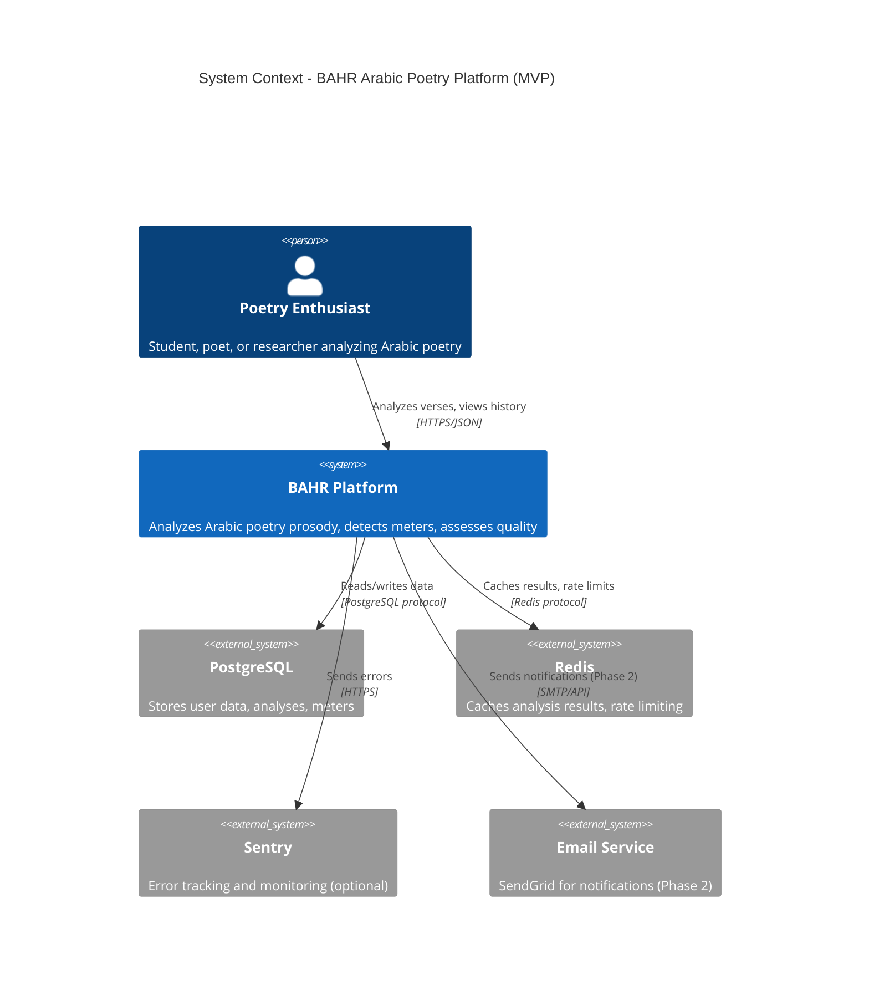

### Key Actors:
- **User:** Interacts with BAHR via web browser (Next.js frontend)
- **BAHR Platform:** Core system (FastAPI backend + Prosody Engine)
- **External Systems:** Database, cache, monitoring, email (future)

---

## 2. Container Diagram (C4 Level 2)

**Purpose:** Shows the major technical containers that make up BAHR.

### Mermaid Diagram:

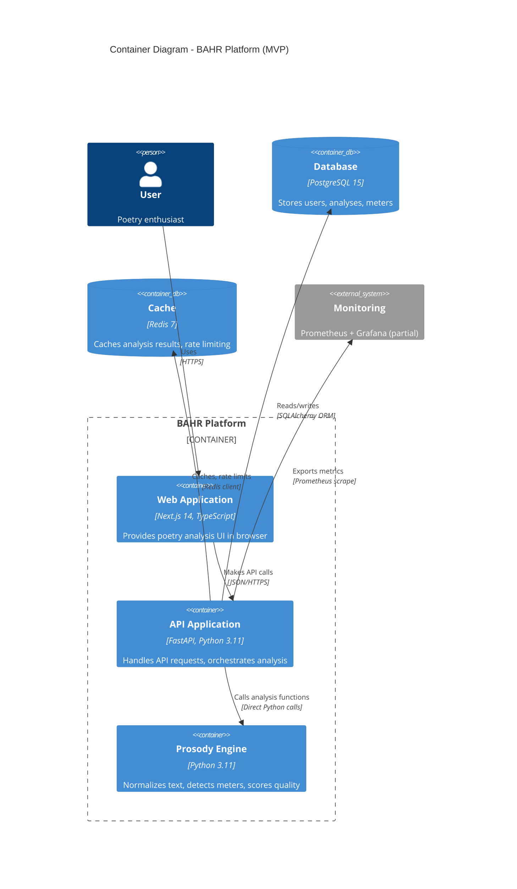

### Container Responsibilities:

| Container | Technology | Purpose | Scaling Strategy |
|-----------|-----------|---------|------------------|
| **Web Application** | Next.js 14 (App Router) | User interface, form validation | Serverless (Vercel) |
| **API Application** | FastAPI + Uvicorn | Request handling, auth, routing | Horizontal (Docker containers) |
| **Prosody Engine** | Python 3.11 (CAMeL Tools) | Text analysis, meter detection | In-process (no separate deployment) |
| **Database** | PostgreSQL 15 | Persistent data storage | Vertical (managed service: Supabase/Neon) |
| **Cache** | Redis 7 | Ephemeral data, rate limiting | Managed service (Railway Redis) |

---

## 3. Component Diagram (C4 Level 3)

**Purpose:** Internal structure of the API Application container.

### Mermaid Diagram:

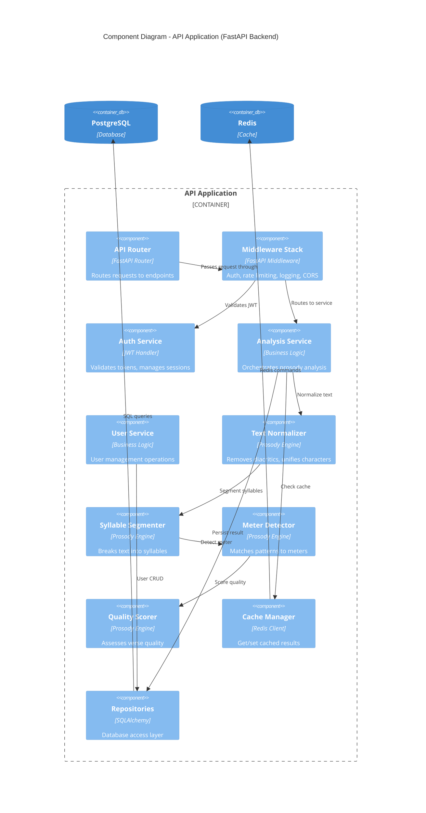

### Component Interaction:

**Request Path:**
1. Router receives `/api/v1/analyze` POST
2. Middleware validates JWT, checks rate limit
3. Analysis Service checks cache (Redis)
4. If cache miss: Normalizer → Segmenter → Detector → Scorer
5. Analysis Service persists result (PostgreSQL via Repository)
6. Response returned with envelope

---

## 4. Sequence Diagrams

### 4.1 Verse Analysis Flow (Happy Path)

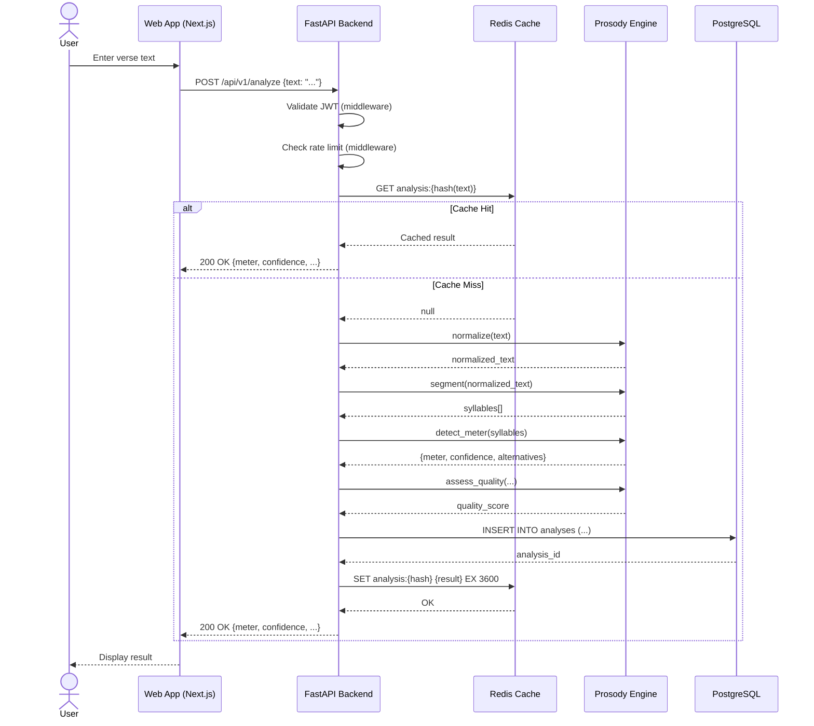

**Key Points:**
- Cache reduces latency from ~500ms to ~30ms
- Normalization is idempotent (same input → same output)
- All steps logged with request_id for tracing

---

### 4.2 User Registration Flow

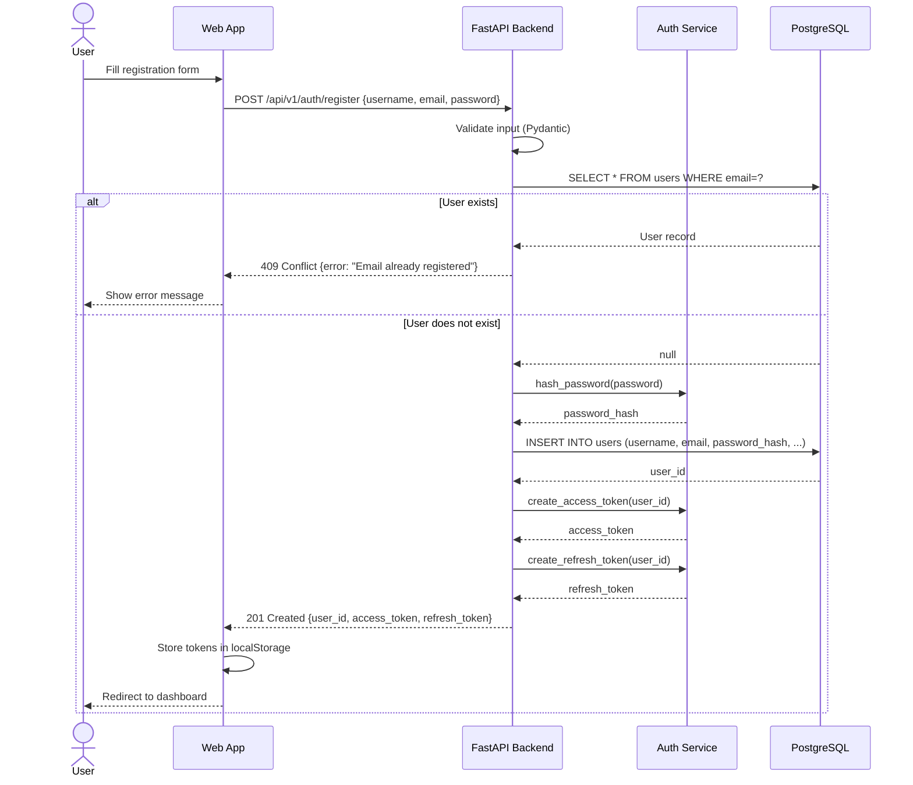

**Security Notes:**
- Password hashed with bcrypt (cost factor 12)
- JWT includes jti (JWT ID) for revocation
- Refresh token valid for 7 days, access token 30 minutes

---

### 4.3 Error Handling Flow (Graceful Degradation)

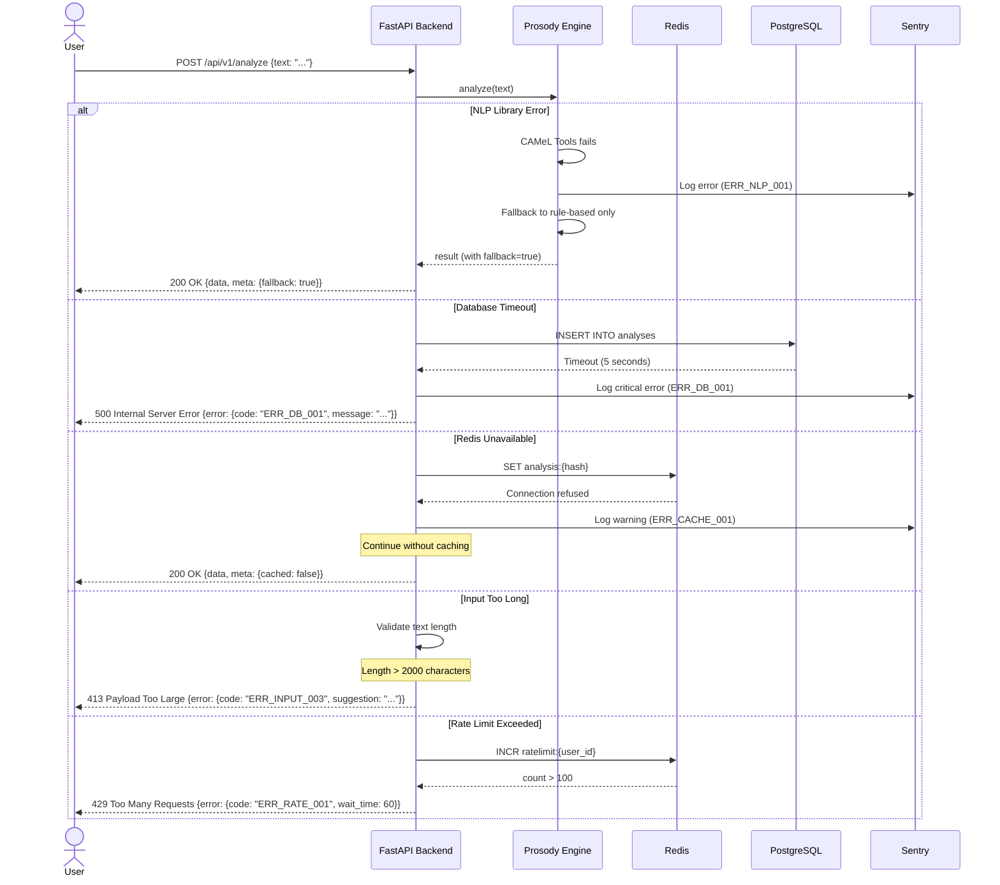

**Fallback Strategy:**
1. CAMeL Tools fails → Use simple regex-based normalization
2. Database unavailable → Return result without persisting (log error)
3. Redis unavailable → Continue without cache (performance hit, but functional)
4. All external systems down → Return basic analysis with warnings

---

## 5. Data Flow Diagrams

### 5.1 Analysis Request Data Flow

```mermaid
flowchart TB
    Start([User submits verse]) --> Input[/"Raw Arabic text\n(with diacritics)"/]
    
    Input --> Normalize["Normalize Text\n- Remove diacritics\n- Unify Alif variants\n- Clean punctuation"]
    
    Normalize --> Normalized[/"Normalized text\n(plain Arabic)"/]
    
    Normalized --> Segment["Syllable Segmentation\n- CV pattern detection\n- Long/short classification"]
    
    Segment --> Syllables[/"Syllable array\n[{text, long}, ...]"/]
    
    Syllables --> Pattern["Build Pattern\n- Convert to '-' (long) and 'u' (short)\n- Group into feet"]
    
    Pattern --> PatternStr[/"Pattern string\n'- u - - | - u u - | ...'"/]
    
    PatternStr --> Match["Meter Matching\n- Compare to 16 meter signatures\n- Calculate similarity scores"]
    
    Match --> Candidates[/"Meter candidates\n[{name, conf}, ...]"/]
    
    Candidates --> Calibrate["Confidence Calibration\n- Adjust for verse length\n- Consider zihafat\n- Factor in era"]
    
    Calibrate --> FinalMeter[/"Final meter\n{name, confidence, alternatives}"/]
    
    FinalMeter --> Quality["Quality Assessment\n- Meter adherence\n- Syllable balance\n- Vocabulary richness"]
    
    Quality --> Result[/"Analysis result\n{meter, quality_score, suggestions}"/]
    
    Result --> Cache{Cache?}
    Cache -->|Yes| Redis[("Redis\nTTL: 3600s")]
    Cache -->|If authenticated| DB[("PostgreSQL\nPermanent")]
    
    Redis --> End([Return to user])
    DB --> End
    
    style Start fill:#d4edda
    style End fill:#d4edda
    style Input fill:#fff3cd
    style Normalized fill:#fff3cd
    style Syllables fill:#fff3cd
    style PatternStr fill:#fff3cd
    style Candidates fill:#fff3cd
    style FinalMeter fill:#cfe2ff
    style Result fill:#cfe2ff
    style Redis fill:#f8d7da
    style DB fill:#f8d7da
```

**Data Transformations:**

| Stage | Input Example | Output Example | Transformation |
|-------|--------------|----------------|----------------|
| Raw Input | `قِفَا نَبْكِ` | (same) | User provides |
| Normalize | `قِفَا نَبْكِ` | `قفا نبك` | Remove diacritics, clean |
| Segment | `قفا نبك` | `[{text:"قفا", long:true}, {text:"نبك", long:false}]` | Syllable detection |
| Pattern | Syllables | `"- u - -"` | Map long/short |
| Meter Detect | `"- u - -"` | `{name:"الطويل", conf:0.92}` | Pattern matching |
| Quality | All above | `{score:0.85, suggestions:[...]}` | Multi-factor assessment |

---

### 5.2 Cache Decision Flow

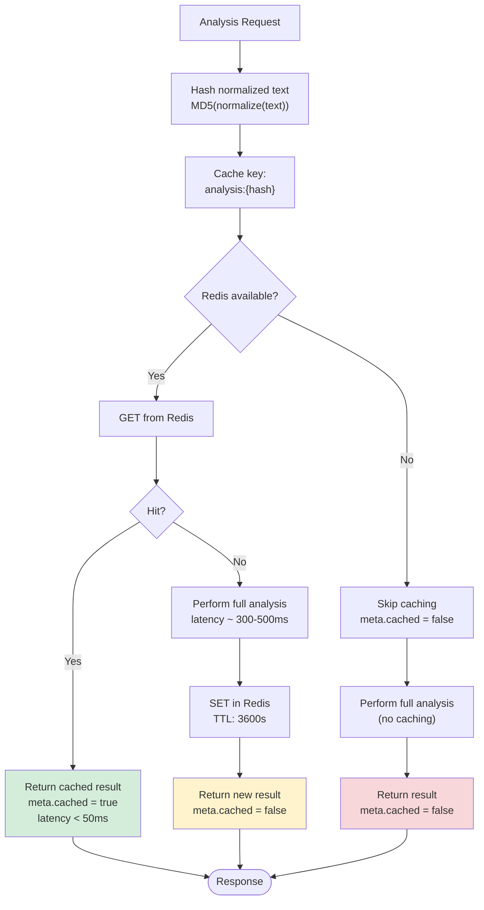

**Cache Strategy:**
- **TTL:** 3600 seconds (1 hour)
- **Key Format:** `analysis:{md5(normalized_text)}`
- **Eviction:** LRU (Least Recently Used)
- **Target Hit Rate:** >40%

**Benefits:**
- Cache hit: ~30ms latency (10x faster)
- Reduced database load
- Improved user experience
- Lower infrastructure costs

---

## 6. Deployment Architecture

### 6.1 MVP Deployment (Railway)

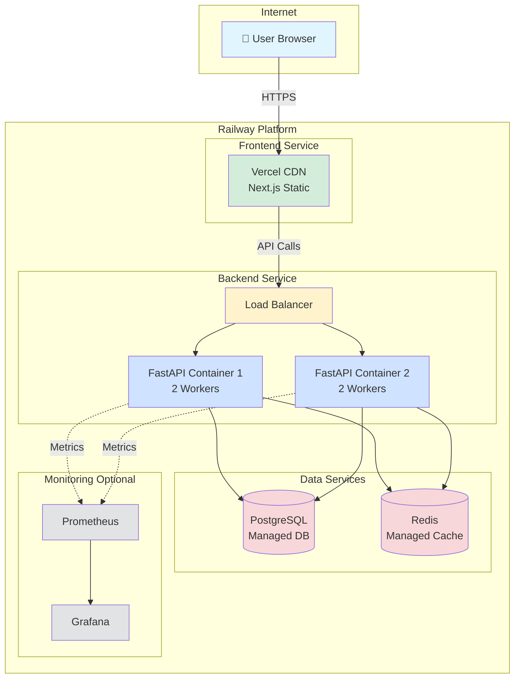

**Infrastructure:**
- **Frontend:** Vercel (serverless, global CDN)
- **Backend:** Railway containers (2x, auto-scaling)
- **Database:** Railway PostgreSQL (managed)
- **Cache:** Railway Redis (managed)
- **Monitoring:** Partial (Prometheus + Grafana)

**Scaling Triggers:**
- CPU > 70% → Add backend container
- Memory > 80% → Vertical scale database
- Request rate > 100/sec → Add container

---

### 6.2 Production Deployment (DigitalOcean - Week 13+)

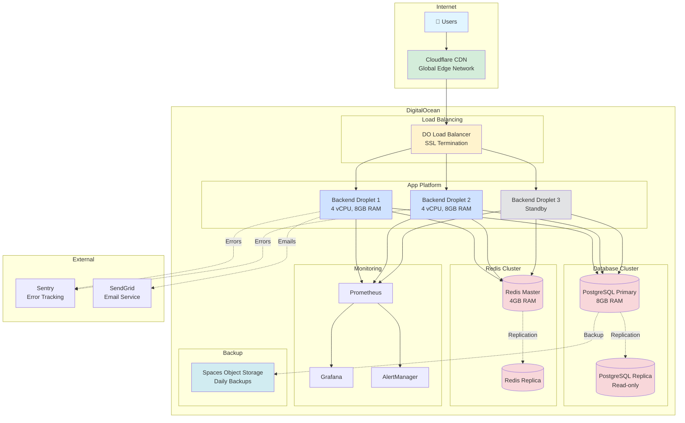

**Production Features:**
- **High Availability:** 3 backend instances (2 active, 1 standby)
- **Database Replication:** Read replica for analytics/reports
- **Redis Replication:** Failover support
- **Automated Backups:** Daily PostgreSQL dumps to S3-compatible storage
- **SSL/TLS:** Cloudflare edge certificates
- **DDoS Protection:** Cloudflare WAF
- **Monitoring:** Full Prometheus + Grafana + AlertManager
- **Error Tracking:** Sentry integration

---

## 7. Integration Points

### 7.1 External System Dependencies

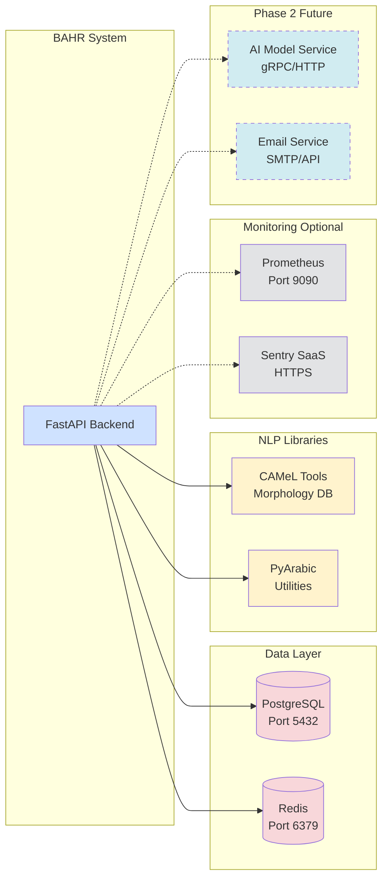

**Dependency Matrix:**

| System | Purpose | Protocol | Failure Impact | Mitigation |
|--------|---------|----------|----------------|------------|
| PostgreSQL | Persistent storage | TCP 5432 | Cannot save analyses | Circuit breaker, return error |
| Redis | Cache + rate limit | TCP 6379 | Slow responses | Continue without cache |
| CAMeL Tools | Arabic NLP | In-process | Lower accuracy | Fallback to rule-based |
| Prometheus | Metrics | HTTP scrape | No monitoring | Non-critical |
| Sentry | Error tracking | HTTPS | No alerts | Non-critical |

---

## 8. Security Architecture

### 8.1 Defense in Depth

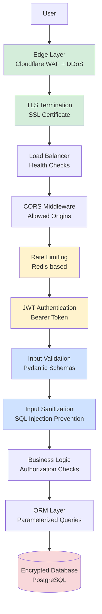

**Security Layers:**

1. **Edge Protection:** WAF, DDoS mitigation (Cloudflare)
2. **Transport Security:** TLS 1.3, HTTPS enforced
3. **Network Security:** Firewall rules, VPC isolation
4. **Application Security:** CORS, rate limiting, JWT
5. **Input Security:** Validation, sanitization, XSS prevention
6. **Data Security:** Encrypted at rest, encrypted in transit
7. **Access Control:** RBAC (Role-Based Access Control)

---

## 9. Diagram Sources (PlantUML)

### 9.1 System Context (PlantUML Source)

```plantuml
@startuml
!include https://raw.githubusercontent.com/plantuml-stdlib/C4-PlantUML/master/C4_Context.puml

LAYOUT_WITH_LEGEND()

title System Context - BAHR Arabic Poetry Platform

Person(user, "Poetry Enthusiast", "Analyzes Arabic poetry")

System(bahr, "BAHR Platform", "Provides prosodic analysis of Arabic verses")

System_Ext(postgres, "PostgreSQL", "Database")
System_Ext(redis, "Redis", "Cache")

Rel(user, bahr, "Uses", "HTTPS")
Rel(bahr, postgres, "Stores data", "TCP")
Rel(bahr, redis, "Caches results", "TCP")

@enduml
```

### 9.2 Container Diagram (PlantUML Source)

```plantuml
@startuml
!include https://raw.githubusercontent.com/plantuml-stdlib/C4-PlantUML/master/C4_Container.puml

title Container Diagram - BAHR Platform

Person(user, "User")

System_Boundary(bahr, "BAHR Platform") {
    Container(web, "Web Application", "Next.js", "UI")
    Container(api, "API", "FastAPI", "Backend")
    Container(engine, "Prosody Engine", "Python", "Analysis")
}

ContainerDb(postgres, "Database", "PostgreSQL")
ContainerDb(redis, "Cache", "Redis")

Rel(user, web, "Uses")
Rel(web, api, "API calls")
Rel(api, engine, "Analyzes")
Rel(api, postgres, "R/W")
Rel(api, redis, "Cache")

@enduml
```

---

## 10. How to Update Diagrams

### Method 1: GitHub Markdown (Recommended)
1. Edit this file directly in GitHub
2. Mermaid diagrams render automatically
3. Commit changes

### Method 2: PlantUML
1. Copy PlantUML source (Section 9)
2. Paste into https://plantuml.com/
3. Export as PNG/SVG
4. Add to `docs/diagrams/` folder

### Method 3: Mermaid Live Editor
1. Copy Mermaid source
2. Paste into https://mermaid.live/
3. Export as PNG/SVG
4. Add to documentation

### Diagram Versioning:
- Include version in diagram title: `v1.0 - MVP`
- Date updates in commit messages
- Archive old versions in `docs/diagrams/archive/`

---

## 11. Additional Diagrams Needed (Future Work)

### Phase 2 Additions:
- [ ] AI Model Architecture (inference flow)
- [ ] Competition System (matchmaking, scoring)
- [ ] Social Features (following, notifications)
- [ ] Admin Dashboard (moderation workflow)
- [ ] Analytics Pipeline (data warehousing)

### Operational Diagrams:
- [ ] CI/CD Pipeline (GitHub Actions flow)
- [ ] Backup & Recovery (disaster recovery)
- [ ] Scaling Strategy (auto-scaling triggers)
- [ ] Cost Optimization (resource allocation)

---

**Document Maintained By:** Architecture Team  
**Last Updated:** November 8, 2025  
**Next Review:** December 1, 2025 (after MVP launch)  
**Tools Used:** Mermaid.js, PlantUML, C4 Model

**References:**
- C4 Model: https://c4model.com/
- Mermaid Docs: https://mermaid.js.org/
- PlantUML: https://plantuml.com/
